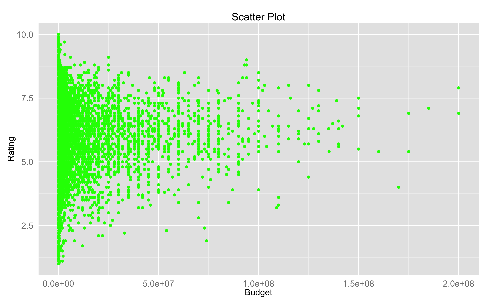
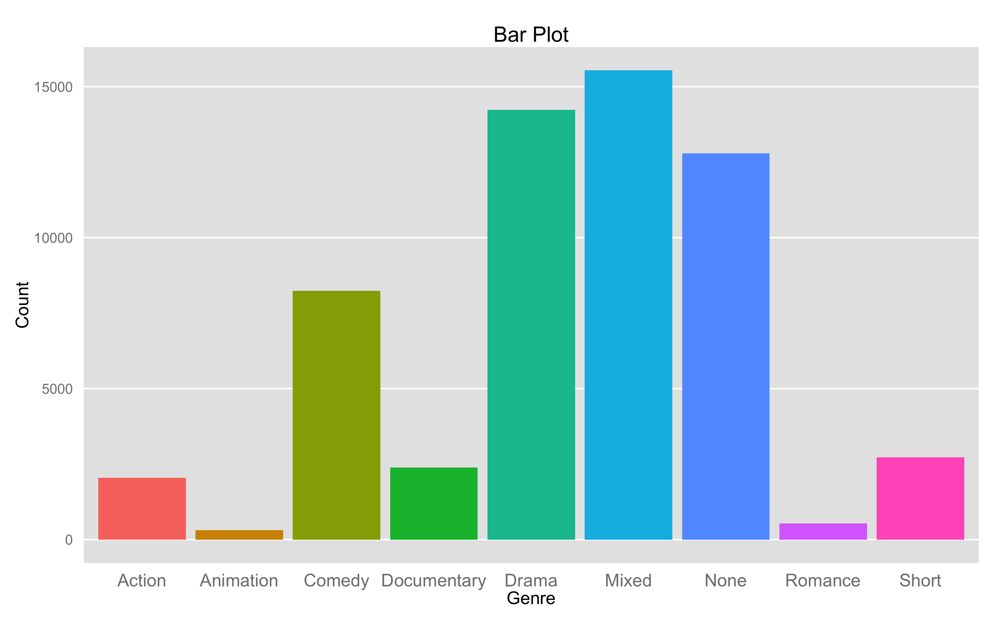
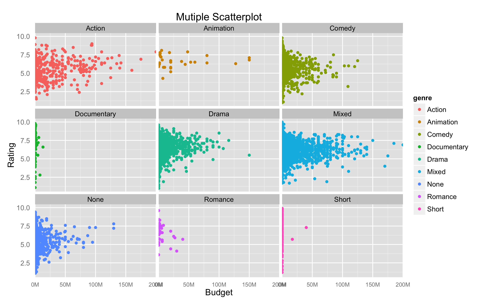
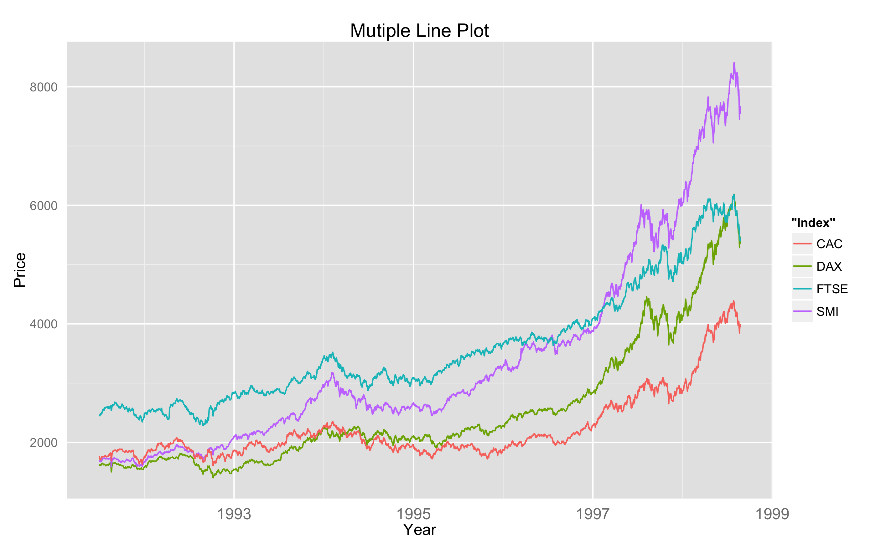

Homework 1: Basic Charts
==============================

| **Name**  | Li Tan  |
|----------:|:-------------|
| **Email** | ltan@dons.usfca.edu |

## Instructions ##

The following packages must be installed prior to running this code:

library(ggplot2) 
data(movies) 
data(EuStockMarkets)

To run this code, please enter the following commands in R:

```
library(devtools)
source_url("https://raw.github.com/Lee26116/msan622/hw1.R")
```

## Discussion ##

perform the following transformations to prepare:

- Filter out any rows that have a `budget` value less than or equal to 0 in the `movies` dataset. 

- Add a `genre` column to the `movies` dataset as follows:
  ```
  genre <- rep(NA, nrow(movies))
  count <- rowSums(movies[, 18:24])
  genre[which(count > 1)] = "Mixed"
  genre[which(count < 1)] = "None"
  genre[which(count == 1 & movies$Action == 1)] = "Action"
  genre[which(count == 1 & movies$Animation == 1)] = "Animation"
  genre[which(count == 1 & movies$Comedy == 1)] = "Comedy"
  genre[which(count == 1 & movies$Drama == 1)] = "Drama"
  genre[which(count == 1 & movies$Documentary == 1)] = "Documentary"
  genre[which(count == 1 & movies$Romance == 1)] = "Romance"
  genre[which(count == 1 & movies$Short == 1)] = "Short"
  ```

- Transform the `EuStockMarkets` dataset to a time series as follows:
  ```
  eu <- transform(data.frame(EuStockMarkets), time = time(EuStockMarkets))
  ```

For plot1, I generated a scatter plot of rating vs budget, I removed ticks for both axis and enlarged the axis fonts, I also paint the dots in green, the image is like following:


For plot 2, I generated the bar chart of Genre with the count of each category as y axis, using different colours to indicate different categories. I also removed ticks as well as veritcal grid lines.


For plot 3, I generated the multi-scatter plots of rating vs budget, in terms of each category in Genre. I used different colours for each plot, change x-axis format into "%dM".


For plot4, I generated the multi-line plots of the prices of each European stock indexes in the different years. I removed the ticks as well as enlarged the axis fonts.


